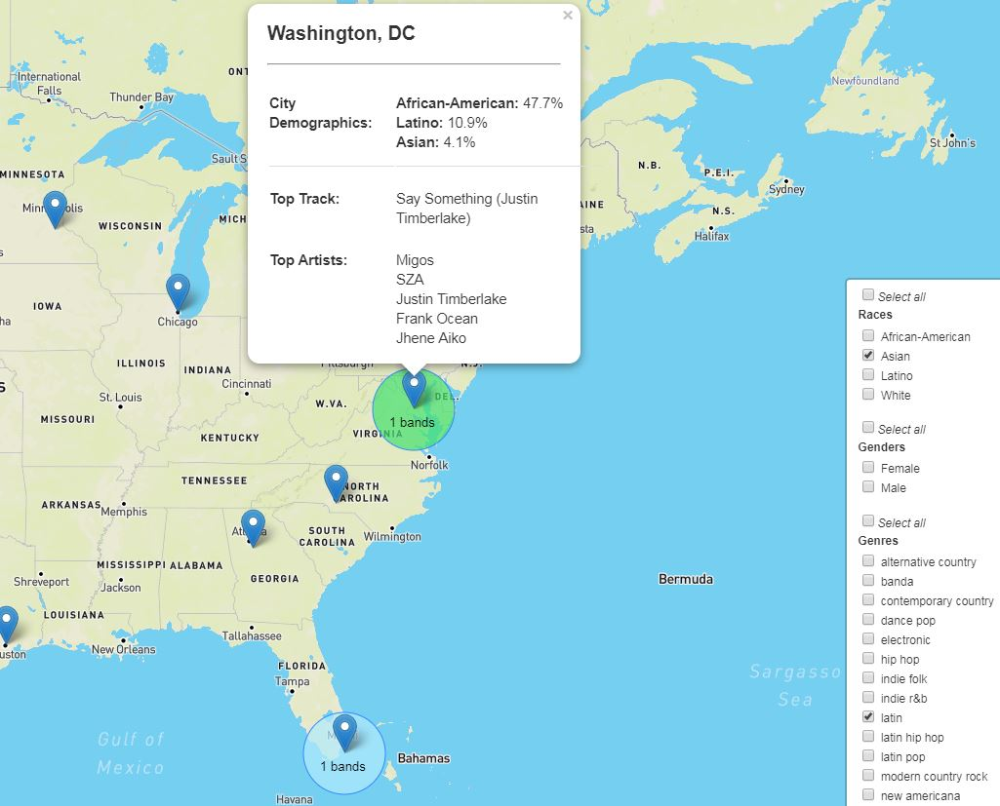

#  Spotify Musical Tastes by City

### Description
Analysis and visualization of Spotify listening preferences across 15 cities: listing city demographics alongside top artists and song for each city. Filters for genre, race, and gender.
**Note:** This project's full history can be viewed in the original repository: [Popular Music Insights](https://github.com/Anaisdg/Popular_Music_Insights). (The code in this repository includes only the parts I authored.)

### Demo
View the [app on Heroku](https://mighty-taiga-44531.herokuapp.com/static/map.html).

App screenshot:


### Technologies Employed 

* [Spotipy API for Spotify](http://spotipy.readthedocs.io/en/latest/#api-reference)
* [Flask](http://flask.pocoo.org/docs/0.12/quickstart/) and [Flask-PyMongo](https://flask-pymongo.readthedocs.io/en/latest/)
* [Leaflet.js](http://leafletjs.com/)
* [D3](http://d3js.org)
* [Splinter](https://splinter.readthedocs.io/en/latest/)
* [Beautiful Soup](https://www.crummy.com/software/BeautifulSoup/bs4/doc/)
* [LyricWiki](http://lyrics.wikia.com)
* Pandas
* MongoDB

### Folder Breakdown

**[vis_integration](https://github.com/Anaisdg/Popular_Music_Insights/tree/master/vis_integration)**
* Integration of all visualizations, with ```app.py``` to run Flask app.

**[spotify_data](https://github.com/Anaisdg/Popular_Music_Insights/tree/master/spotify_data)**
* Data retrieval, analysis, and storage of artist, genre, song, gender, race, and city demographic data - in support of the interactive Leaflet.js map. 

### Inspiration for map visualization
* [Spotify Insights Blog](https://insights.spotify.com/us/2016/12/07/musical-map-of-the-world-2-0/)


